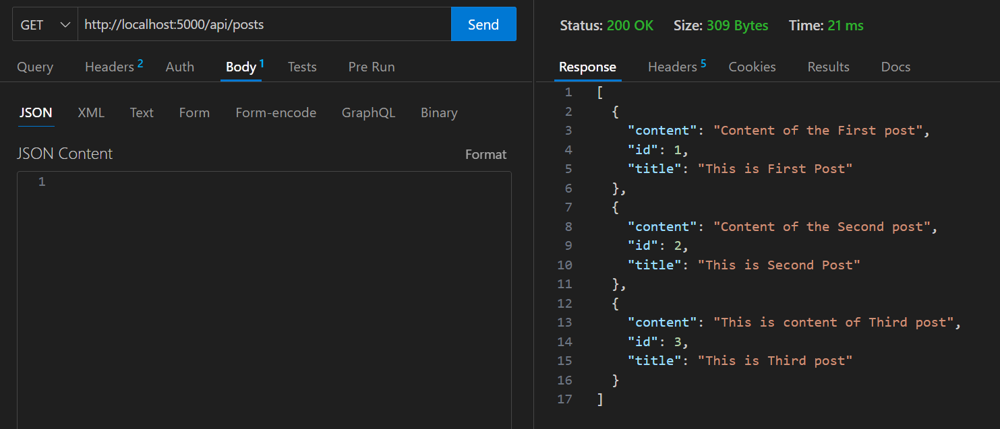
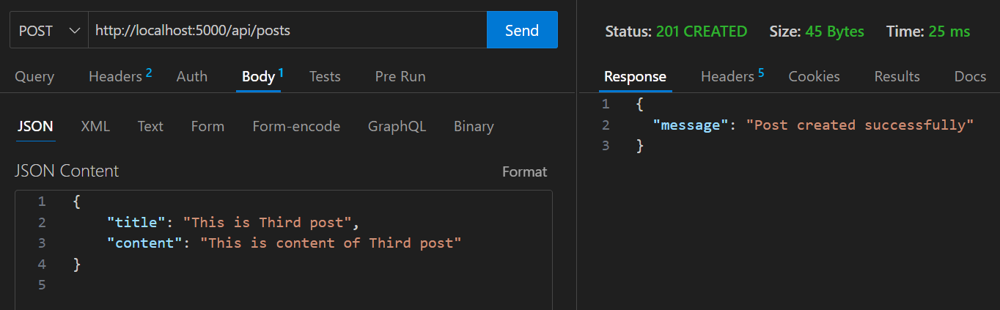
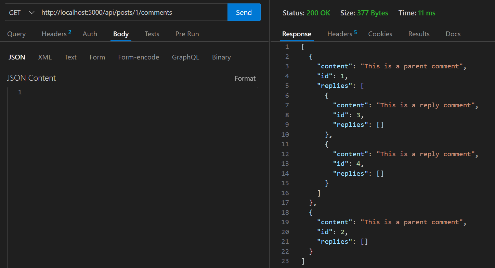
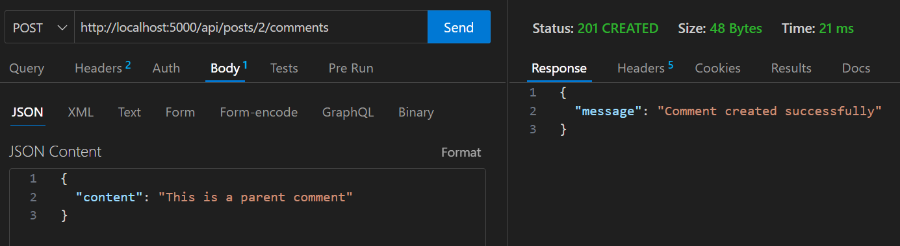
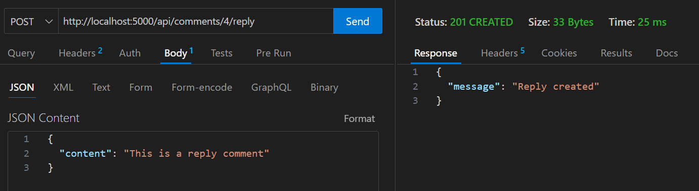

# Blogging Application

This is a simple Flask application that provides a set of APIs for a blogging platform. Users can create posts, comment on posts, reply to comments, and view posts and their associated comments.

## Requirements

- Python 3.9.11
- Flask
- Flask SQLAlchemy
- SQLite (for local development)

## Installation

1. Clone the repository:

   ```bash
   git clone https://github.com/COZYTRICKSTER/blogging-app.git
   ```

2. Navigate to the project directory:

   ```bash
   cd blogging-app
   ```

3. Create a virtual environment:

   ```bash
   python -m venv venv-blog
   ```

4. Activate the virtual environment:

   - On Windows:

     ```bash
     venv-blog\Scripts\activate
     ```

   - On macOS/Linux:
  
     ```bash
     source venv-blog/bin/activate
     ```

5. Install dependencies:

   ```bash
   pip install -r requirements.txt
   ```

## Usage

1. Run the Flask application:

   ```bash
   python run.py
   ```

2. The API endpoints are accessible at `http://localhost:5000`.

## API Endpoints

- `GET /api/posts`: Retrieve all posts.

- `POST /api/posts`: Create a new post.

- `GET /api/posts/<post_id>/comments`: Retrieve comments for a specific post.

- `POST /api/posts/<post_id>/comments`: Create a new comment on a post.

- `POST /api/comments/<comment_id>/reply`: Reply to an existing comment.



## Testing

To run unit tests, execute the following command:

```bash
python -m unittest discover tests
```
